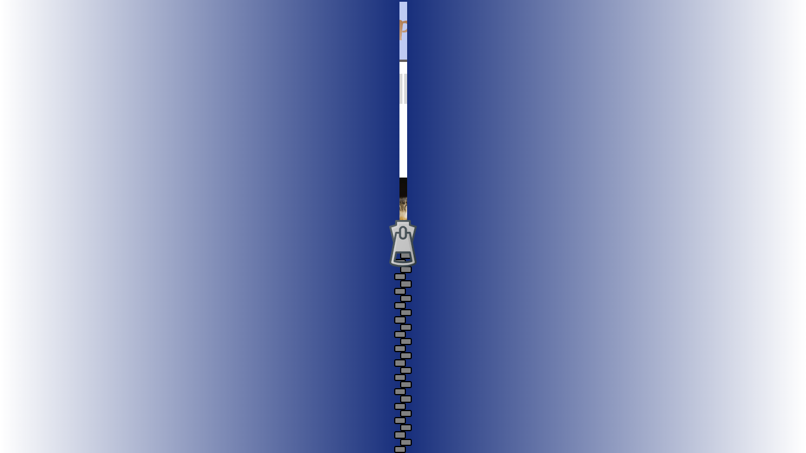
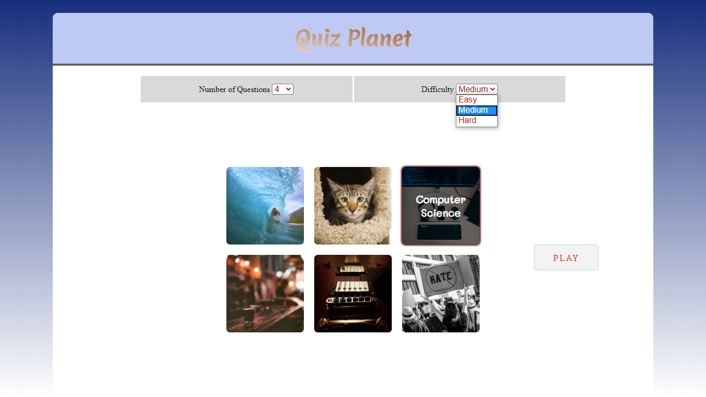
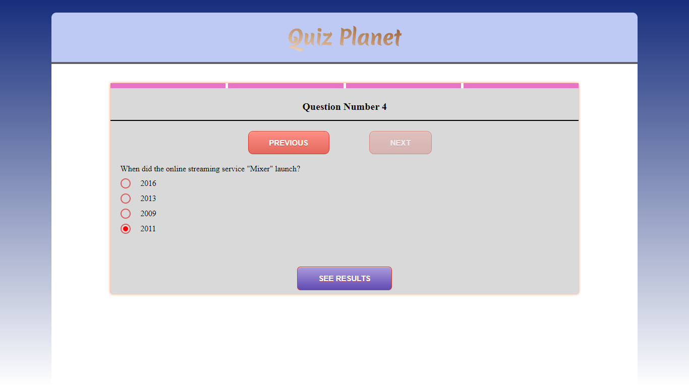

# QuizPlanet

is a Web-based trivia Game built with Angular 9.
It's fun to play and it helps you learn ton of facts about all kind of fields.

### Implemented Features & Techniques :

* Questions are fetched from a cost-free RESTful API [opentdb](opentdb.com).
* Angular Animation is used for smoother transition between different routes.
* Styling templates made-easy via Sass and heavy use of Flexbox and CSS Grid.
* Custom Directives are implemented to access and manipulate the DOM (for UI purposes)
* Angular Services are used for proper state management. 
* App is fully responsive and ideal for use on mobile devices.

==> Click [here](https://quizplanet-42507.web.app/) to check it out.

__________________________________________________________________

__________________________________________________________________

__________________________________________________________________

